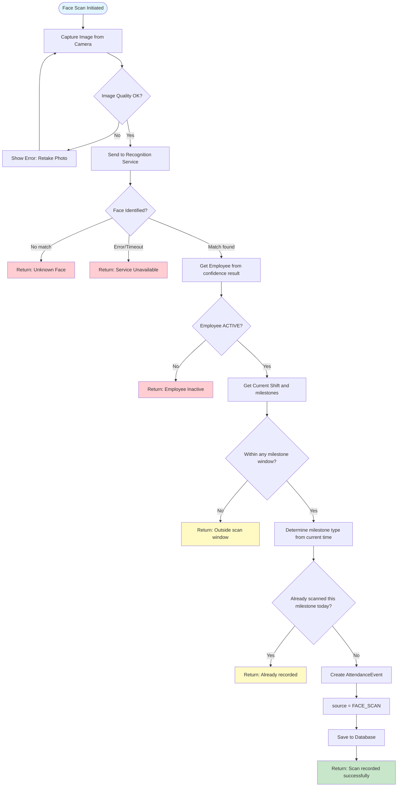
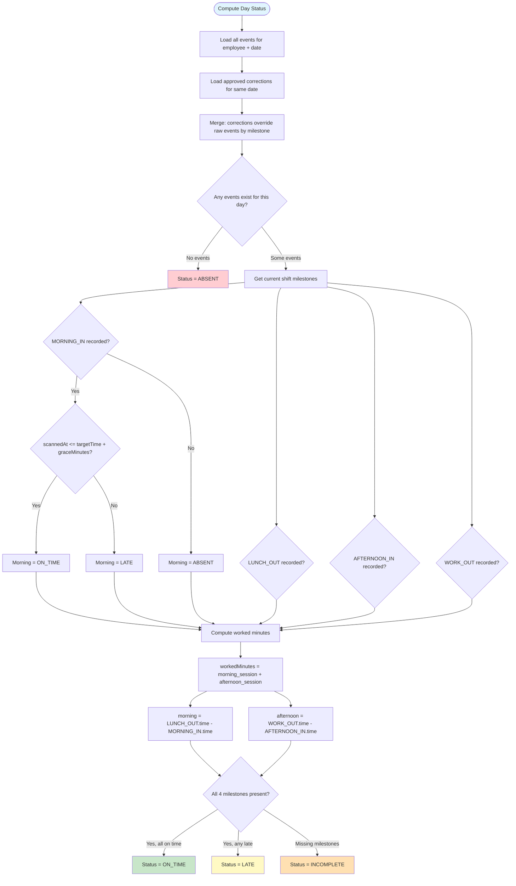
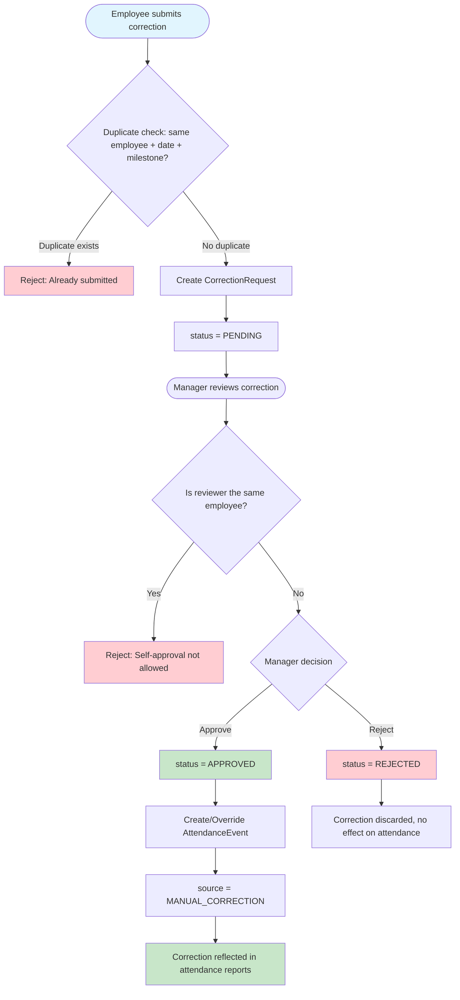

# Activity Diagram: Core Business Flows

## Attendance Recording Flow

```mermaid
flowchart TD
    A([Face Scan Initiated]) --> B[Capture Image from Camera]
    B --> C{Image Quality OK?}
    C -->|No| D[Show Error: Retake Photo]
    D --> B
    C -->|Yes| E[Send to Recognition Service]
    E --> F{Face Identified?}

    F -->|No match| G[Return: Unknown Face]
    F -->|Error/Timeout| H[Return: Service Unavailable]

    F -->|Match found| I[Get Employee from confidence result]
    I --> J{Employee ACTIVE?}
    J -->|No| K[Return: Employee Inactive]

    J -->|Yes| L[Get Current Shift and milestones]
    L --> M{Within any milestone window?}
    M -->|No| N[Return: Outside scan window]

    M -->|Yes| O[Determine milestone type from current time]
    O --> P{Already scanned this milestone today?}
    P -->|Yes| Q[Return: Already recorded]

    P -->|No| R[Create AttendanceEvent]
    R --> S[source = FACE_SCAN]
    S --> T[Save to Database]
    T --> U[Return: Scan recorded successfully]

    style A fill:#e1f5fe
    style U fill:#c8e6c9
    style G fill:#ffcdd2
    style H fill:#ffcdd2
    style K fill:#ffcdd2
    style N fill:#fff9c4
    style Q fill:#fff9c4
```

## Daily Attendance Status Computation

```mermaid
flowchart TD
    A([Compute Day Status]) --> B[Load all events for employee + date]
    B --> C[Load approved corrections for same date]
    C --> D[Merge: corrections override raw events by milestone]
    D --> E{Any events exist for this day?}

    E -->|No events| F[Status = ABSENT]

    E -->|Some events| G[Get current shift milestones]

    G --> H{MORNING_IN recorded?}
    H -->|No| I[Morning = ABSENT]
    H -->|Yes| J{scannedAt <= targetTime + graceMinutes?}
    J -->|Yes| K[Morning = ON_TIME]
    J -->|No| L[Morning = LATE]

    G --> M{LUNCH_OUT recorded?}
    G --> N{AFTERNOON_IN recorded?}
    G --> O{WORK_OUT recorded?}

    K --> P[Compute worked minutes]
    L --> P
    I --> P
    M --> P
    N --> P
    O --> P

    P --> Q[workedMinutes = morning_session + afternoon_session]
    Q --> R[morning = LUNCH_OUT.time - MORNING_IN.time]
    Q --> S[afternoon = WORK_OUT.time - AFTERNOON_IN.time]

    R --> T{All 4 milestones present?}
    S --> T
    T -->|Yes, all on time| U[Status = ON_TIME]
    T -->|Yes, any late| V[Status = LATE]
    T -->|Missing milestones| W[Status = INCOMPLETE]

    style A fill:#e1f5fe
    style F fill:#ffcdd2
    style U fill:#c8e6c9
    style V fill:#fff9c4
    style W fill:#ffe0b2
```

## Correction Request Lifecycle

```mermaid
flowchart TD
    A([Employee submits correction]) --> B{Duplicate check: same employee + date + milestone?}
    B -->|Duplicate exists| C[Reject: Already submitted]

    B -->|No duplicate| D[Create CorrectionRequest]
    D --> E[status = PENDING]
    E --> F([Manager reviews correction])

    F --> G{Is reviewer the same employee?}
    G -->|Yes| H[Reject: Self-approval not allowed]

    G -->|No| I{Manager decision}
    I -->|Approve| J[status = APPROVED]
    I -->|Reject| K[status = REJECTED]

    J --> L[Create/Override AttendanceEvent]
    L --> M[source = MANUAL_CORRECTION]
    M --> N[Correction reflected in attendance reports]

    K --> O[Correction discarded, no effect on attendance]

    style A fill:#e1f5fe
    style C fill:#ffcdd2
    style H fill:#ffcdd2
    style J fill:#c8e6c9
    style K fill:#ffcdd2
    style N fill:#c8e6c9
```
