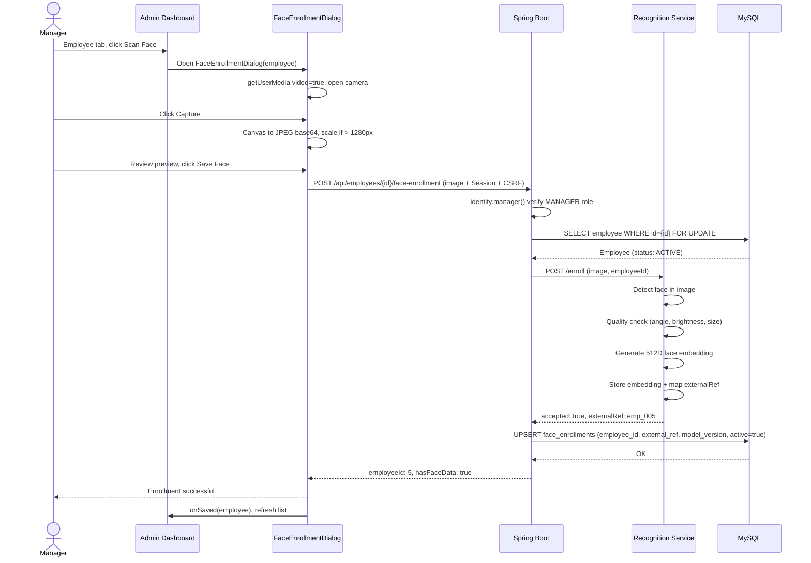

# Sequence Diagram: Employee Face Enrollment Flow

```mermaid
sequenceDiagram
    actor MGR as Manager
    participant FE as Admin Dashboard
    participant DLG as FaceEnrollmentDialog
    participant BE as Spring Boot
    participant AI as Recognition Service
    participant DB as MySQL

    MGR->>FE: Employee tab, click Scan Face
    FE->>DLG: Open FaceEnrollmentDialog(employee)

    DLG->>DLG: getUserMedia video=true, open camera

    MGR->>DLG: Click Capture
    DLG->>DLG: Canvas to JPEG base64, scale if > 1280px

    MGR->>DLG: Review preview, click Save Face
    DLG->>BE: POST /api/employees/{id}/face-enrollment (image + Session + CSRF)

    BE->>BE: identity.manager() verify MANAGER role
    BE->>DB: SELECT employee WHERE id={id} FOR UPDATE
    DB-->>BE: Employee (status: ACTIVE)

    BE->>AI: POST /enroll (image, employeeId)

    AI->>AI: Detect face in image
    AI->>AI: Quality check (angle, brightness, size)
    AI->>AI: Generate 512D face embedding
    AI->>AI: Store embedding + map externalRef
    AI-->>BE: accepted: true, externalRef: emp_005

    BE->>DB: UPSERT face_enrollments (employee_id, external_ref, model_version, active=true)
    DB-->>BE: OK

    BE-->>DLG: employeeId: 5, hasFaceData: true
    DLG-->>MGR: Enrollment successful
    DLG->>FE: onSaved(employee), refresh list
```

> Uses pessimistic locking (lockById) to prevent race conditions. Face enrollment is UPSERT (create new or update if already exists).
