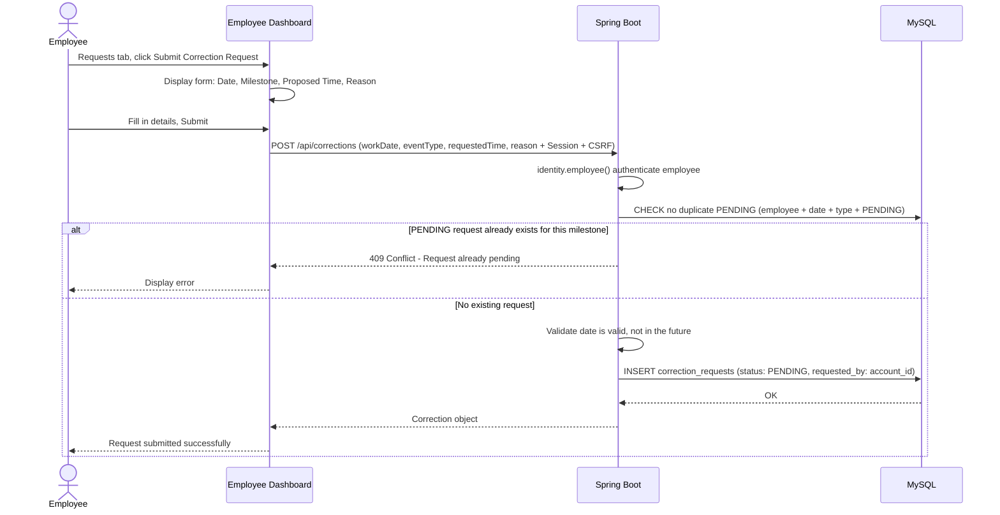

# Sequence Diagram: Submit Time Correction Request (Employee)

```mermaid
sequenceDiagram
    actor EMP as Employee
    participant FE as Employee Dashboard
    participant BE as Spring Boot
    participant DB as MySQL

    EMP->>FE: Requests tab, click Submit Correction Request
    FE->>FE: Display form: Date, Milestone, Proposed Time, Reason
    EMP->>FE: Fill in details, Submit

    FE->>BE: POST /api/corrections (workDate, eventType, requestedTime, reason + Session + CSRF)

    BE->>BE: identity.employee() authenticate employee
    BE->>DB: CHECK no duplicate PENDING (employee + date + type + PENDING)

    alt PENDING request already exists for this milestone
        BE-->>FE: 409 Conflict - Request already pending
        FE-->>EMP: Display error
    else No existing request
        BE->>BE: Validate date is valid, not in the future
        BE->>DB: INSERT correction_requests (status: PENDING, requested_by: account_id)
        DB-->>BE: OK
        BE-->>FE: Correction object
        FE-->>EMP: Request submitted successfully
    end
```
