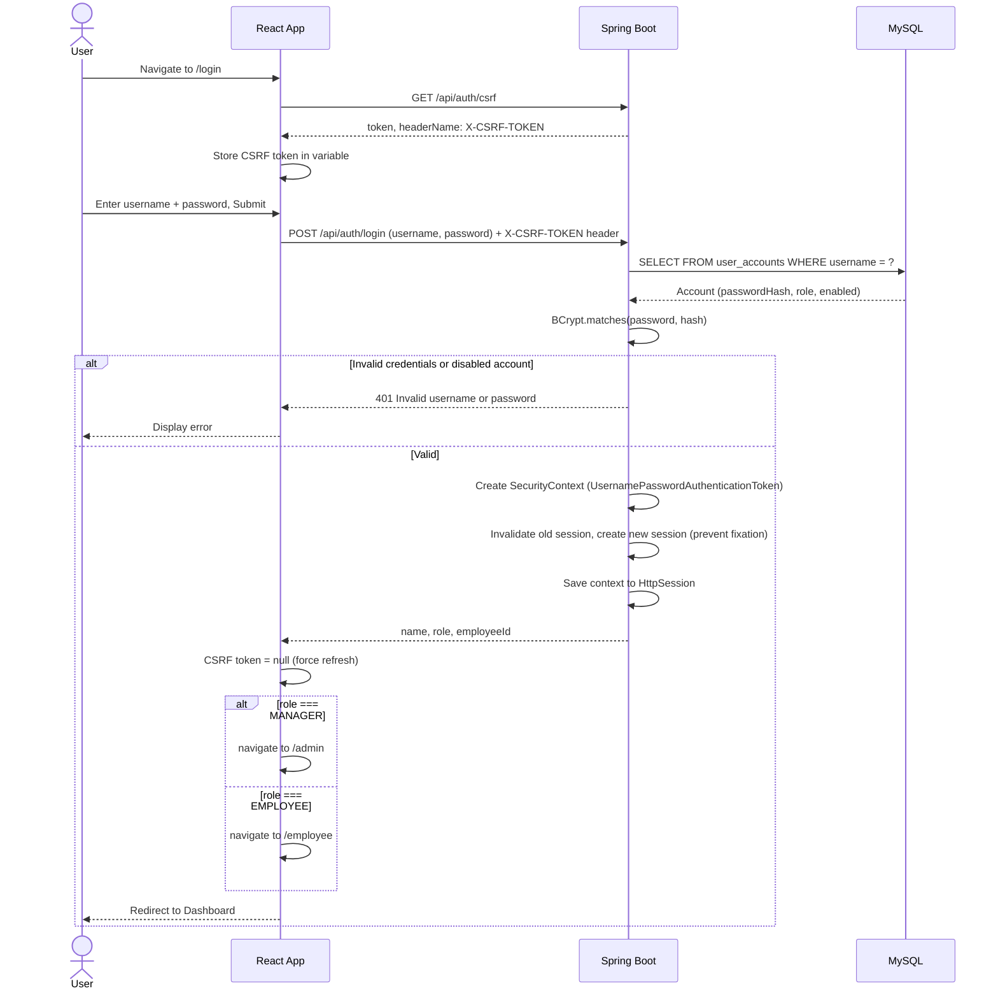

# Sequence Diagram: Login Flow

```mermaid
sequenceDiagram
    actor U as User
    participant FE as React App
    participant BE as Spring Boot
    participant DB as MySQL

    U->>FE: Navigate to /login
    FE->>BE: GET /api/auth/csrf
    BE-->>FE: token, headerName: X-CSRF-TOKEN
    FE->>FE: Store CSRF token in variable

    U->>FE: Enter username + password, Submit
    FE->>BE: POST /api/auth/login (username, password) + X-CSRF-TOKEN header

    BE->>DB: SELECT FROM user_accounts WHERE username = ?
    DB-->>BE: Account (passwordHash, role, enabled)

    BE->>BE: BCrypt.matches(password, hash)

    alt Invalid credentials or disabled account
        BE-->>FE: 401 Invalid username or password
        FE-->>U: Display error
    else Valid
        BE->>BE: Create SecurityContext (UsernamePasswordAuthenticationToken)
        BE->>BE: Invalidate old session, create new session (prevent fixation)
        BE->>BE: Save context to HttpSession

        BE-->>FE: name, role, employeeId
        FE->>FE: CSRF token = null (force refresh)

        alt role === MANAGER
            FE->>FE: navigate to /admin
        else role === EMPLOYEE
            FE->>FE: navigate to /employee
        end
        FE-->>U: Redirect to Dashboard
    end
```

> Session-based authentication with CSRF protection. Old session is invalidated on successful login to prevent session fixation attacks.
