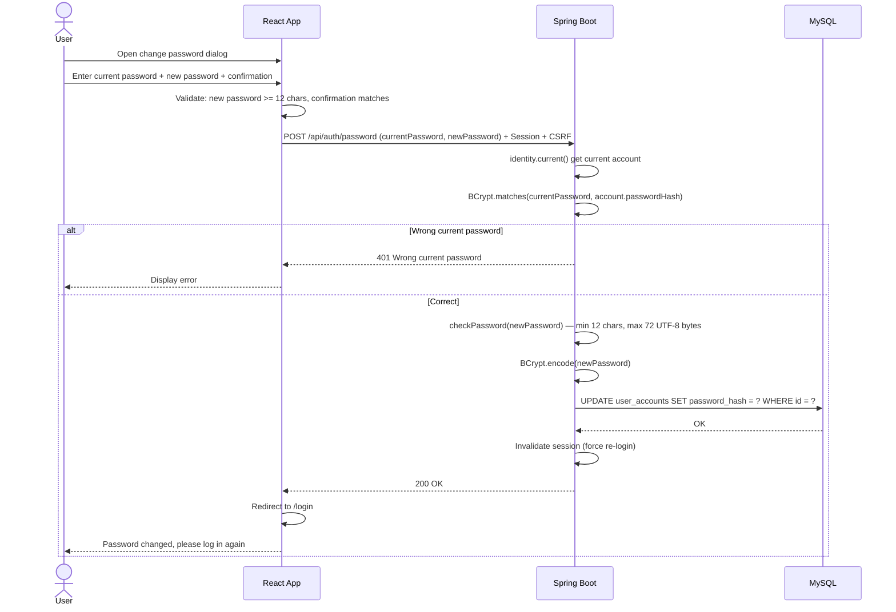

# Sequence Diagram: Change Password Flow

```mermaid
sequenceDiagram
    actor U as User
    participant FE as React App
    participant BE as Spring Boot
    participant DB as MySQL

    U->>FE: Open change password dialog
    U->>FE: Enter current password + new password + confirmation
    FE->>FE: Validate: new password >= 12 chars, confirmation matches

    FE->>BE: POST /api/auth/password (currentPassword, newPassword) + Session + CSRF

    BE->>BE: identity.current() get current account
    BE->>BE: BCrypt.matches(currentPassword, account.passwordHash)

    alt Wrong current password
        BE-->>FE: 401 Wrong current password
        FE-->>U: Display error
    else Correct
        BE->>BE: checkPassword(newPassword) — min 12 chars, max 72 UTF-8 bytes
        BE->>BE: BCrypt.encode(newPassword)
        BE->>DB: UPDATE user_accounts SET password_hash = ? WHERE id = ?
        DB-->>BE: OK
        BE->>BE: Invalidate session (force re-login)
        BE-->>FE: 200 OK
        FE->>FE: Redirect to /login
        FE-->>U: Password changed, please log in again
    end
```
