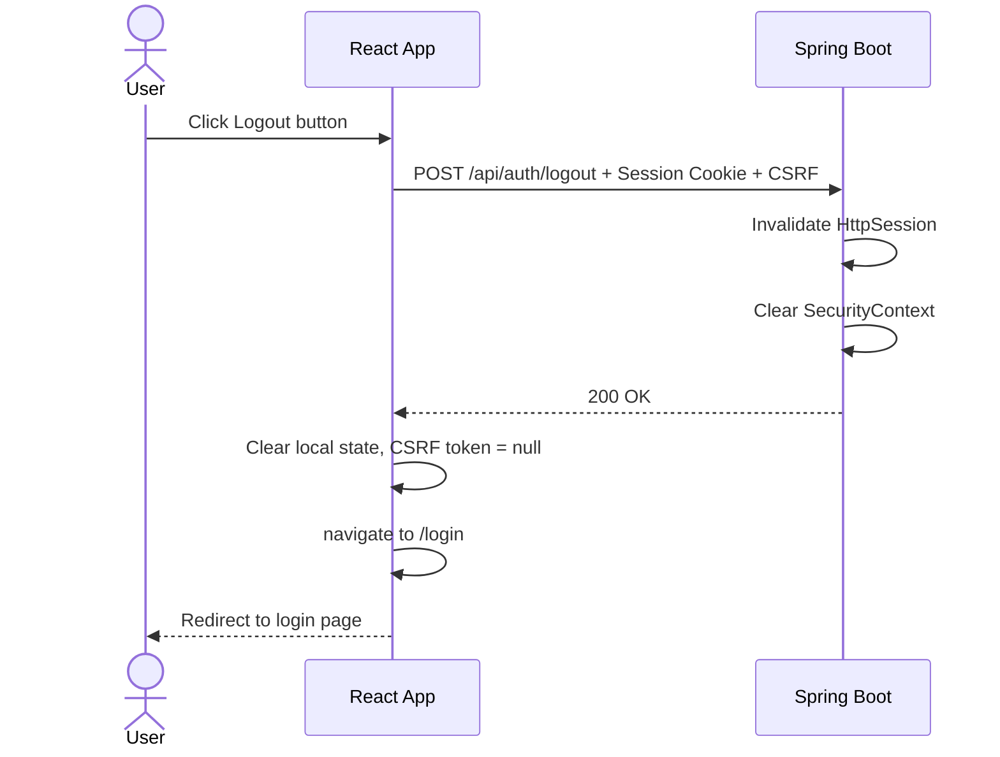

# Sequence Diagram: Logout Flow

```mermaid
sequenceDiagram
    actor U as User
    participant FE as React App
    participant BE as Spring Boot

    U->>FE: Click Logout button
    FE->>BE: POST /api/auth/logout + Session Cookie + CSRF

    BE->>BE: Invalidate HttpSession
    BE->>BE: Clear SecurityContext
    BE-->>FE: 200 OK

    FE->>FE: Clear local state, CSRF token = null
    FE->>FE: navigate to /login
    FE-->>U: Redirect to login page
```
