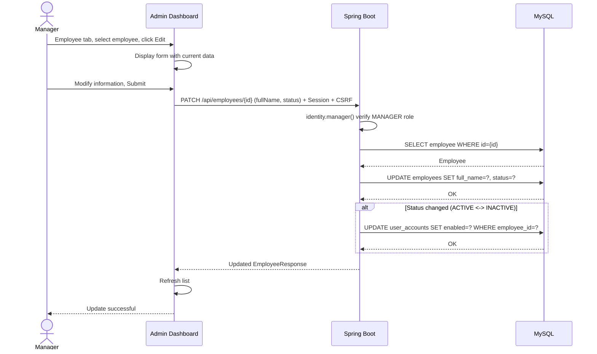

# Sequence Diagram: Employee Management — Update

```mermaid
sequenceDiagram
    actor MGR as Manager
    participant FE as Admin Dashboard
    participant BE as Spring Boot
    participant DB as MySQL

    MGR->>FE: Employee tab, select employee, click Edit
    FE->>FE: Display form with current data
    MGR->>FE: Modify information, Submit

    FE->>BE: PATCH /api/employees/{id} (fullName, status) + Session + CSRF

    BE->>BE: identity.manager() verify MANAGER role
    BE->>DB: SELECT employee WHERE id={id}
    DB-->>BE: Employee

    BE->>DB: UPDATE employees SET full_name=?, status=?
    DB-->>BE: OK

    alt Status changed (ACTIVE <-> INACTIVE)
        BE->>DB: UPDATE user_accounts SET enabled=? WHERE employee_id=?
        DB-->>BE: OK
    end

    BE-->>FE: Updated EmployeeResponse
    FE->>FE: Refresh list
    FE-->>MGR: Update successful
```
