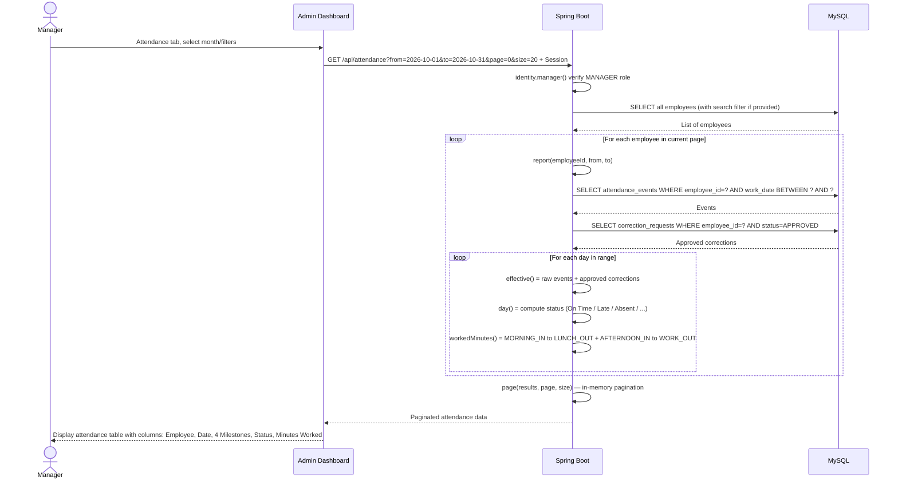

# Sequence Diagram: View Attendance Records (Manager)

```mermaid
sequenceDiagram
    actor MGR as Manager
    participant FE as Admin Dashboard
    participant BE as Spring Boot
    participant DB as MySQL

    MGR->>FE: Attendance tab, select month/filters
    FE->>BE: GET /api/attendance?from=2026-10-01&to=2026-10-31&page=0&size=20 + Session

    BE->>BE: identity.manager() verify MANAGER role
    BE->>DB: SELECT all employees (with search filter if provided)
    DB-->>BE: List of employees

    loop For each employee in current page
        BE->>BE: report(employeeId, from, to)
        BE->>DB: SELECT attendance_events WHERE employee_id=? AND work_date BETWEEN ? AND ?
        DB-->>BE: Events
        BE->>DB: SELECT correction_requests WHERE employee_id=? AND status=APPROVED
        DB-->>BE: Approved corrections

        loop For each day in range
            BE->>BE: effective() = raw events + approved corrections
            BE->>BE: day() = compute status (On Time / Late / Absent / ...)
            BE->>BE: workedMinutes() = MORNING_IN to LUNCH_OUT + AFTERNOON_IN to WORK_OUT
        end
    end

    BE->>BE: page(results, page, size) — in-memory pagination
    BE-->>FE: Paginated attendance data

    FE-->>MGR: Display attendance table with columns: Employee, Date, 4 Milestones, Status, Minutes Worked
```
