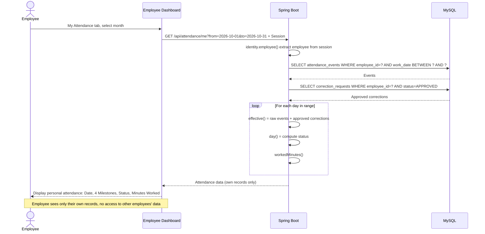

# Sequence Diagram: View Attendance Records (Employee)

```mermaid
sequenceDiagram
    actor EMP as Employee
    participant FE as Employee Dashboard
    participant BE as Spring Boot
    participant DB as MySQL

    EMP->>FE: My Attendance tab, select month
    FE->>BE: GET /api/attendance/me?from=2026-10-01&to=2026-10-31 + Session

    BE->>BE: identity.employee() extract employee from session
    BE->>DB: SELECT attendance_events WHERE employee_id=? AND work_date BETWEEN ? AND ?
    DB-->>BE: Events
    BE->>DB: SELECT correction_requests WHERE employee_id=? AND status=APPROVED
    DB-->>BE: Approved corrections

    loop For each day in range
        BE->>BE: effective() = raw events + approved corrections
        BE->>BE: day() = compute status
        BE->>BE: workedMinutes()
    end

    BE-->>FE: Attendance data (own records only)

    FE-->>EMP: Display personal attendance: Date, 4 Milestones, Status, Minutes Worked

    Note over EMP,FE: Employee sees only their own records, no access to other employees' data
```
